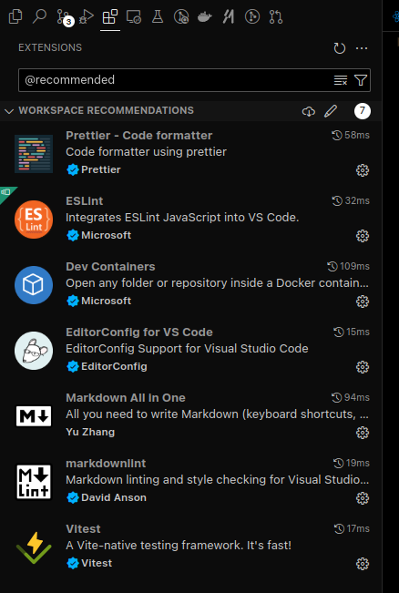
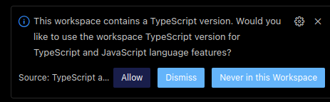
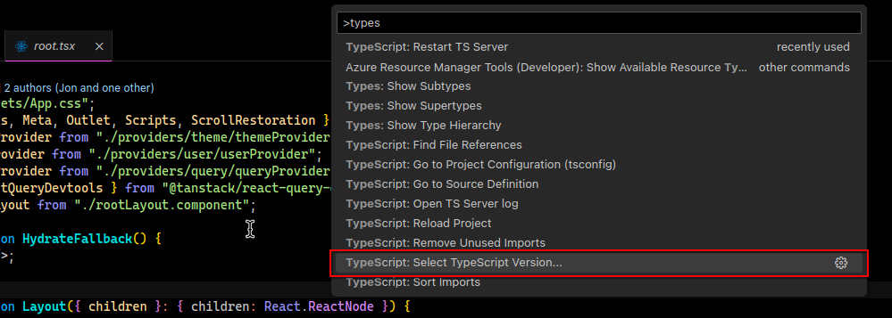
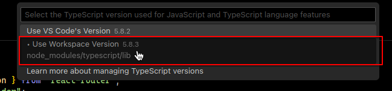
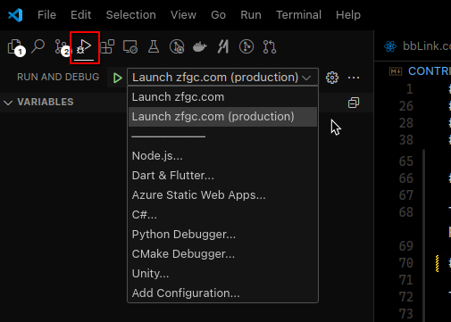

# Contributing

When contributing to this repository, please first discuss the change you wish to make via issue,
email, or any other method with the owners of this repository before making a change.

Please note we have a code of conduct, please follow it in all your interactions with the project.

TBD. We could use some help writing this out.

## Table of Contents

- [Contributing](#contributing)
  - [Table of Contents](#table-of-contents)
  - [Development](#development)
    - [Downloading the Project](#downloading-the-project)
    - [package.json - Provided package.json scripts](#packagejson---provided-packagejson-scripts)
      - [`yarn dev`: Starts the development server](#yarn-dev-starts-the-development-server)
      - [`yarn build`: Builds the application for production](#yarn-build-builds-the-application-for-production)
        - [Packaging for Production](#packaging-for-production)
      - [`yarn check`: Runs type checking, linting, and formatting checks](#yarn-check-runs-type-checking-linting-and-formatting-checks)
      - [`yarn format`: Formats the code using Prettier](#yarn-format-formats-the-code-using-prettier)
      - [`yarn preview`: Runs the application in the production mode (SPA Mode)](#yarn-preview-runs-the-application-in-the-production-mode-spa-mode)
      - [`yarn preview:ssr`: Runs the application in the production mode with server-side rendering](#yarn-previewssr-runs-the-application-in-the-production-mode-with-server-side-rendering)
        - [package.json - Usage](#packagejson---usage)
        - [Troubleshooting](#troubleshooting)
          - [Why is the forum not loading?](#why-is-the-forum-not-loading)
          - [Why is there a warning about the `ReactQueryDevtools` package?](#why-is-there-a-warning-about-the-reactquerydevtools-package)
      - [VSCode - Usage](#vscode---usage)
        - [VSCode - Recommended Extensions](#vscode---recommended-extensions)
        - [VSCode - Typescript Workspace Version](#vscode---typescript-workspace-version)
        - [VSCode - Running the application (Launch Tasks)](#vscode---running-the-application-launch-tasks)
        - [VSCode - Using the devcontainer (optional)](#vscode---using-the-devcontainer-optional)
    - [Workflow - Typical Development Workflow](#workflow---typical-development-workflow)
  - [CI/CD \[WIP\]](#cicd-wip)
    - [.github/workflows/workflows-ci.yml](#githubworkflowsworkflows-ciyml)
    - [./github/workflows/workflow-deploy-frontend.yml](#githubworkflowsworkflow-deploy-frontendyml)

## Development

We recommend using [VSCode](#vscode---usage) for development. If you are not using VSCode, you can use the provided package.json scripts to get started. To begin, you will need to download the project.

### Downloading the Project

1. Make sure you have [Node.js](https://nodejs.org/en/download/) installed. (We recommend using the current LTS version).
2. Make sure you have [Git](https://git-scm.com/downloads) installed.
3. Clone the repository

   ```bash
   git clone https://github.com/ZFGCCP/ZFGCBB-React.git
   ```

If you are not using VSCode, you can use the provided package.json scripts to get started.

### [package.json](package.json) - Provided package.json scripts

The `yarn dev` and `yarn build` commands reference the [.env.local](.env.local) file or if specified, the [.env.production](.env.production) file. Utilizing the [.env.production](.env.production) file provides a method for testing the frontend against the production backend hosted on [zfgc.com](http://zfgc.com).

Specifying an environment can be done by using the `--mode` flag.

For example, to run the frontend in production mode, you can use the following command:

```bash
yarn dev --mode=production
```

The same flag can be used with the `yarn build` command, with the same effect.

Continue reading to learn more about the package.json scripts.

#### `yarn dev`: Starts the development server

This command starts the development server, using [react-router/dev](https://reactrouter.com/start/framework/installation) and `vite`. `react-router` builds on top of `vite` to create a development server.

Since `yarn dev` forwards to `react-router dev`, the arguments for `react-router` can be forwarded to `yarn dev` as well.

```text
  `dev` Options:
    --clearScreen       Allow/disable clear screen when logging (boolean)
    --config, -c        Use specified config file (string)
    --cors              Enable CORS (boolean)
    --force             Force the optimizer to ignore the cache and re-bundle (boolean)
    --host              Specify hostname (string)
    --logLevel, -l      Info | warn | error | silent (string)
    --mode, -m          Set env mode (string)
    --open              Open browser on startup (boolean | string)
    --port              Specify port (number)
    --profile           Start built-in Node.js inspector
    --strictPort        Exit if specified port is already in use (boolean)
```

#### `yarn build`: Builds the application for production

This command builds the application for production, using [react-router](https://reactrouter.com/tutorials/quickstart#build-and-run).

Since `yarn build` forwards to `react-router build`, the arguments for `react-router` can be forwarded to `yarn build` as well.

```text
  `build` Options:
    --assetsInlineLimit Static asset base64 inline threshold in bytes (default: 4096) (number)
    --clearScreen       Allow/disable clear screen when logging (boolean)
    --config, -c        Use specified config file (string)
    --emptyOutDir       Force empty outDir when it's outside of root (boolean)
    --logLevel, -l      Info | warn | error | silent (string)
    --minify            Enable/disable minification, or specify minifier to use (default: "esbuild") (boolean | "terser" | "esbuild")
    --mode, -m          Set env mode (string)
    --profile           Start built-in Node.js inspector
    --sourcemapClient   Output source maps for client build (default: false) (boolean | "inline" | "hidden")
    --sourcemapServer   Output source maps for server build (default: false) (boolean | "inline" | "hidden")
```

##### Packaging for Production

The `yarn build` command will package the application for production. The `NODE_ENV` environment variable is set to `production` by default on most systems. If you wish to override this, you can use the `--mode` flag. [See above for more information](#packagejson---provided-packagejson-scripts).

```bash
yarn build --mode=production
```

This will package the application for production and output the production build to the `build/client` directory in the project root.

If you have zip installed, you can use the following command to create a zip file of the production build.

```bash
rm -f build.zip && zip -rj build.zip build/client/
```

#### `yarn check`: Runs type checking, linting, and formatting checks

This commands runs type checking, linting, and formatting checks using [TypeScript](https://www.typescriptlang.org/) and [Prettier](https://prettier.io/), and [react-router](https://reactrouter.com/tutorials/quickstart#build-and-run)'s typegen command. It will throw an error if any of the checks fail.

#### `yarn format`: Formats the code using Prettier

This command formats the code using [Prettier](https://prettier.io/).

#### `yarn preview`: Runs the application in the production mode (SPA Mode)

This project supports both SPA Mode and SSR Mode. This command runs the application in [SPA Mode](https://reactrouter.com/how-to/spa), using [vite](https://vitejs.dev/).

SPA Mode is the default mode for this project.

#### `yarn preview:ssr`: Runs the application in the production mode with server-side rendering

**NOTE:** This command is not currently supported, and should not be used for now. Use the [yarn preview](#yarn-preview-runs-the-application-in-the-production-mode-spa-mode) command instead if testing preview of a production build.

This command runs the application in SSR Mode, using [react-router](https://reactrouter.com/tutorials/quickstart#build-and-run). See also documentation for [react-router SPA Mode](https://reactrouter.com/how-to/spa) for more context over the differences between SPA Mode and SSR Mode.

<!-- - `yarn preview:ssr`: Runs the application in the production mode with server-side rendering
- `yarn start`: Runs the application in production mode with server-side rendering -->

##### [package.json](package.json) - Usage

1. Configure the project (Have the prequisites installed - see [README.md](README.md))

   ```bash
   corepack enable
   ```

2. Install the dependencies

   ```bash
   yarn install
   ```

3. Start the development server

   ```bash
   yarn dev
   ```

4. Open your browser and navigate to <http://localhost:5173>.
5. You can now proceed to [Workflow - Typical Development Workflow](#workflow---typical-development-workflow) for more information.

##### Troubleshooting

###### Why is the forum not loading?

The default value is pointing to your local machine. While we do have dockerfiles for the backend, we haven't gotten around to streamlining using the backend in a development setting for the frontend. To run the frontend locally, pointed to `zfgc.com`, run `yarn dev --mode=production`, and that will point to the production environment. This will get you up and running! \o/

###### Why is there a warning about the `ReactQueryDevtools` package?

Error example:

```bash
"ReactQueryDevtools" is imported from external module "@tanstack/react-query-devtools" but never used in "src/root.tsx".
```

The `ReactQueryDevtools` package is used for debugging purposes. When using `yarn build` in production mode, the `ReactQueryDevtools` package is not included in the production build.

#### VSCode - Usage

VSCode is our preferred IDE for development. To get the best experience, try installing the recommended extensions. The provided launch tasks will automatically configure the project for you and allow you to set breakpoints and debug your code. Continue to [VSCode - Recommended Extensions](#vscode---recommended-extensions) for more information.

##### VSCode - Recommended Extensions

This project provides [extension recommendations](./.vscode/extensions.json) for VSCode. Press `(CRTL/CMD + SHIFT + X)` to open the Extensions panel on the sidebar. You can use the `@recommended` tag to only install extensions that are recommended by this project. See <https://code.visualstudio.com/docs/configure/extensions/extension-marketplace#_recommended-extensions> for more information.



If the sidebar looks like this, then you can install the recommended extensions if the option is available. After you've installed the recommended extensions, you can continue to [VSCode - Typescript Workspace Version](#vscode---typescript-workspace-version) for more information.

##### VSCode - Typescript Workspace Version

Please be sure to allow the [Typescript Workspace Version](https://code.visualstudio.com/docs/typescript/typescript-compiling#_using-the-workspace-version) to be enabled. This will allow you to get type checking and intellisense for the entire project.



If you cannot find the notification, then you can use the command palette to achieve the same thing. \*NOTE: Open a TypeScript file first, such as [src/root.tsx](src/root.tsx). Otherwise the `Typescript: Select Typescript Version` won't be available as an option.

You can press `(CRTL/CMD + SHIFT + P)` to open the Command Palette. Then, type `TypeScript: Select TypeScript Version` and select `Use Workspace Version`.



Then you should be prompted to select a version. Select `Use Workspace Version`.



If a notification pops up, you will need to press `Allow`. After you've pressed `Allow`, you can proceed to [VSCode - Running the application (Launch Tasks)](#vscode---running-the-application-launch-tasks) for more information.

##### VSCode - Running the application (Launch Tasks)

The VSCode project is setup with two [launch tasks](./.vscode/launch.json):

Find the launch tasks by navigating to the `Run and Debug` section `(CRTL/CMD + SHIFT + D)` of the sidebar.



- `Launch zfgc.com`: Runs the application in development mode pointed to <http://localhost:8080/zfgbb> or the value of `REACT_ZFGBB_API_URL` in [.env.local](.env.local).
- `Launch zfgc.com (production)`: Runs the application pointed to `zfgc.com` for the backend, using the value of `REACT_ZFGBB_API_URL` in [.env.production](.env.production).

Both of these tasks will also run `corepack enable` and `yarn install` before running the application. So, you do not need to worry aobut that. See [.vscode/tasks.json](./.vscode/tasks.json) if you would like to see how these tasks run those commands.

Now that you are ready, you can proceed to [Workflow - Typical Development Workflow](#workflow---typical-development-workflow) for more information.

##### VSCode - Using the devcontainer (optional)

If you would like to avoid having to setup a development environment on your actual machine. This repository implements a VS Code Dev Container, which can give you a simple way to get started developing! To learn more about the VS Code Dev Containers, check out the [documentation](https://code.visualstudio.com/docs/devcontainers/containers).

1. Install the [Remote - Containers extension](https://marketplace.visualstudio.com/items?itemName=ms-vscode-remote.remote-containers) in VSCode.
2. Open the project in VSCode.
3. Press `CRTL + P` and type `Remote-Containers: Reopen in Container`.
4. Wait for the container to start.
5. Open your browser and navigate to <http://localhost:5173>.

### Workflow - Typical Development Workflow

1. Read the [Code of Conduct](CODE_OF_CONDUCT.md).
2. If you are not part of the ZFGCCP organization, you will need to fork this repository.
3. Make sure you are on the `development` branch. `git switch development && git pull`.
4. Make a new branch for your changes. `git switch -c my-new-branch`.
   1. How do I name my branch? See the next section, we have some recommendations, but we don't have any official rules so you can use whatever naming convention you prefer for your branch.
   2. Brach Naming Conventions (General Recommendations)
      1. If you are working on a new feature, you can name your branch `feature/my-new-feature`.
      2. If you are working on a bug fix, you can name your branch `bugfix/my-bug-fix` or `fix/my-bug-fix`.
      3. If you are working on a documentation change, you can name your branch `docs/my-docs-change`.
      4. If you are working on a refactor, you can name your branch `refactor/my-refactor`.
      5. If you are working on a test, you can name your branch `test/my-test`.
      6. You are ready to start working on your branch!
5. Working on your changes: Use your IDE of choice to edit files and save changes.
   1. Use the `yarn dev` command to start the development server. Make sure to run `yarn install` before running the command.
      1. If you are using VSCode, you can use the `Launch zfgc.com` launch task to do this for you.
      2. For now, if cloning the [backend](https://github.com/ZFGCCP/ZFGCBB) is too much of a hassle, you can use the `yarn dev --mode=production` command to start the development server on `zfgc.com` or `Launch zfgc.com (production) in` VSCode. <!-- FIXME: remove this note when we have a container that can be pulled down and run locally -->
   2. Use the `yarn format` command to format the code using Prettier.
   3. Use the `yarn check` command to run type checking, linting, and formatting checks.
   4. Repeat steps 1-3 as needed until `yarn check` passes.
      1. Feel free to reach out on Discord if you have any questions.
   5. Stage and commit your changes.
   6. Push your changes to your branch on GitHub.
6. [Create a new pull request](https://github.com/ZFGCCP/ZFGCBB-React/compare) and request a review from one of the maintainers.
   1. Add a bullet point list of changes you made.
   2. Mention the issue number you are working on.
      1. If there is no issue, you can create one.
   3. Title the pull request using conventional commits, with `closes #issue-number` included, if applicable.
      1. Example: `feat: add new feature`
      2. See: <https://www.conventionalcommits.org/en/v1.0.0/>
   4. For the duration of your pull request, please keep your branch up to date with the `development` branch.
   5. Your PR must pass all checks before it can be merged or requested for review.
7. As Sonic the Hedgehog says, "Gotta go fast!". And you went fast! Congratulations on making a contribution to the project!

## CI/CD [WIP]

We use GitHub Actions to run the CI/CD pipeline.

### [.github/workflows/workflows-ci.yml](.github/workflows/workflow-ci.yml)

This workflow builds and tests the project on each pull request.

### [./github/workflows/workflow-deploy-frontend.yml](.github/workflows/workflow-deploy-frontend.yml)

This workflow builds and deploys the project to GitHub Pages.
