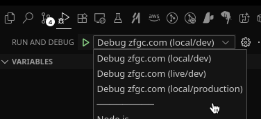

# Contributing

When contributing to this repository, please first discuss the change you wish to make via issue,
email, or any other method with the owners of this repository before making a change.

Please note we have a code of conduct, please follow it in all your interactions with the project.

TBD. We could use some help writing this out.

## Table of Contents

- [Contributing](#contributing)
  - [Table of Contents](#table-of-contents)
  - [Development](#development)
    - [Provided package.json scripts](#provided-packagejson-scripts)
      - [Setting up the project](#setting-up-the-project)
        - [Why is the forum not loading?](#why-is-the-forum-not-loading)
      - [Workflow - Typical Development Workflow](#workflow---typical-development-workflow)
      - [VSCode - Usage](#vscode---usage)
        - [VSCode - Running the application (Launch Tasks)](#vscode---running-the-application-launch-tasks)
        - [VSCode - Typescript Workspace Version](#vscode---typescript-workspace-version)
        - [VSCode - Using the devcontainer (optional)](#vscode---using-the-devcontainer-optional)
  - [Pull Request Process \[WIP\]](#pull-request-process-wip)
  - [CI/CD \[WIP\]](#cicd-wip)
    - [.github/workflows/workflows-ci.yml](#githubworkflowsworkflows-ciyml)
    - [./github/workflows/workflow-deploy-frontend.yml](#githubworkflowsworkflow-deploy-frontendyml)

## Development

### Provided package.json scripts

- `yarn dev`: Starts the development server
- `yarn build`: Builds the application for production
- `yarn check`: Runs type checking, linting, and formatting checks
- `yarn format`: Formats the code using Prettier
- `yarn preview`: Runs the application in the production mode
<!-- - `yarn preview:ssr`: Runs the application in the production mode with server-side rendering
- `yarn start`: Runs the application in production mode with server-side rendering -->

#### Setting up the project

1. Clone the repository

   ```bash
   git clone https://github.com/ZFGCCP/ZFGCBB-React.git
   ```

2. Configure the project (Have the prequisites installed - see [README.md](README.md))

   ```bash
   corepack enable
   ```

3. Install the dependencies

   ```bash
   yarn install
   ```

4. Start the development server

   ```bash
   yarn dev
   ```

5. Open your browser and navigate to <http://localhost:5173>.

##### Why is the forum not loading?

The default value is pointing to your local machine. While we do have dockerfiles for the backend, we haven't gotten around to streamlining using the backend in a development setting for the frontend. To run the frontend locally, pointed to `zfgc.com`, run `yarn dev --mode=production`, and that will point to the production environment. This will get you up and running! \o/

#### Workflow - Typical Development Workflow

1. If you are not part of the ZFGCCP organization, you will need to fork this repository.
2. Make sure you are on the `development` branch. `git switch development && git pull`.
3. Make a new branch for your changes. `git switch -c my-new-branch`.
   1. How do I name my branch? See the next section, we have some recommendations, but we don't have any official rules so you can use whatever naming convention you prefer for your branch.
   2. Brach Naming Conventions (General Recommendations)
      1. If you are working on a new feature, you can name your branch `feature/my-new-feature`.
      2. If you are working on a bug fix, you can name your branch `bugfix/my-bug-fix` or `fix/my-bug-fix`.
      3. If you are working on a documentation change, you can name your branch `docs/my-docs-change`.
      4. If you are working on a refactor, you can name your branch `refactor/my-refactor`.
      5. If you are working on a test, you can name your branch `test/my-test`.
      6. You are ready to start working on your branch!
4. Working on your changes: Use your IDE of choice to edit files and save changes.
   1. Use the `yarn dev` command to start the development server. Make sure to run `yarn install` before running the command.
      1. If you are using VSCode, you can use the `Launch zfgc.com` launch task to do this for you.
      2. For now, if cloning the [backend](https://github.com/ZFGCCP/ZFGCBB) is too much of a hassle, you can use the `yarn dev --mode=production` command to start the development server on `zfgc.com` or `Launch zfgc.com (production) in` VSCode. <!-- FIXME: remove this note when we have a container that can be pulled down and run locally -->
   2. Use the `yarn format` command to format the code using Prettier.
   3. Use the `yarn check` command to run type checking, linting, and formatting checks.
   4. Repeat steps 1-3 as needed until `yarn check` passes.
      1. Feel free to reach out on Discord if you have any questions.
   5. Stage and commit your changes.
   6. Push your changes to your branch on GitHub.
5. [Create a new pull request](https://github.com/ZFGCCP/ZFGCBB-React/compare) and request a review from one of the maintainers.
   1. Add a bullet point list of changes you made.
   2. Mention the issue number you are working on.
      1. If there is no issue, you can create one.
   3. Title the pull request using conventional commits, with `closes #issue-number` included, if applicable.
      1. Example: `feat: add new feature`
      2. See: <https://www.conventionalcommits.org/en/v1.0.0/>
   4. For the duration of your pull request, please keep your branch up to date with the `development` branch.
   5. Your PR must pass all checks before it can be merged or requested for review.
6. As Sonic the Hedgehog says, "Gotta go fast!". And you went fast! Congratulations on making a contribution to the project!

#### VSCode - Usage

This project provides [extension recommendations](./.vscode/extensions.json) for VSCode. Press `(CRTL/CMD + SHIFT + X)` to open the Extensions panel on the sidebar. You can use the `@recommended` tag to only install extensions that are recommended by this project. See <https://code.visualstudio.com/docs/configure/extensions/extension-marketplace#_recommended-extensions> for more information.


If the sidebar looks like this, then you can install the recommended extensions if the option is available.

##### VSCode - Running the application (Launch Tasks)

The VSCode project is setup with two [launch tasks](./.vscode/launch.json):

Find the launch tasks by navigating to the `Run and Debug` section `(CRTL/CMD + SHIFT + D)` of the sidebar.



- `Launch zfgc.com`: Runs the application in development mode
- `Launch zfgc.com (production)`: Runs the application in production mode

Both of these tasks will also run `corepack enable` and `yarn install` before running the application. So, you do not need to worry aobut that. See [.vscode/tasks.json](./.vscode/tasks.json) for more information.

##### VSCode - Typescript Workspace Version

Please be sure to allow the [Typescript Workspace Version](https://code.visualstudio.com/docs/typescript/typescript-compiling#_using-the-workspace-version) to be enabled. This will allow you to get type checking and intellisense for the entire project.


##### VSCode - Using the devcontainer (optional)

If you would like to avoid having to setup a development environment on your actual machine. This repository implements a VS Code Dev Container, which can give you a simple way to get started developing! To learn more about the VS Code Dev Containers, check out the [documentation](https://code.visualstudio.com/docs/devcontainers/containers).

1. Install the [Remote - Containers extension](https://marketplace.visualstudio.com/items?itemName=ms-vscode-remote.remote-containers) in VSCode.
2. Open the project in VSCode.
3. Press `CRTL + P` and type `Remote-Containers: Reopen in Container`.
4. Wait for the container to start.
5. Open your browser and navigate to <http://localhost:5173>.

## Pull Request Process [WIP]

1. Ensure any install or build dependencies are removed before the end of the layer when doing a
   build.
2. TBD.

## CI/CD [WIP]

We use GitHub Actions to run the CI/CD pipeline.

### [.github/workflows/workflows-ci.yml](.github/workflows/workflow-ci.yml)

This workflow builds and tests the project on each pull request.

### [./github/workflows/workflow-deploy-frontend.yml](.github/workflows/workflow-deploy-frontend.yml)

This workflow builds and deploys the project to GitHub Pages.
